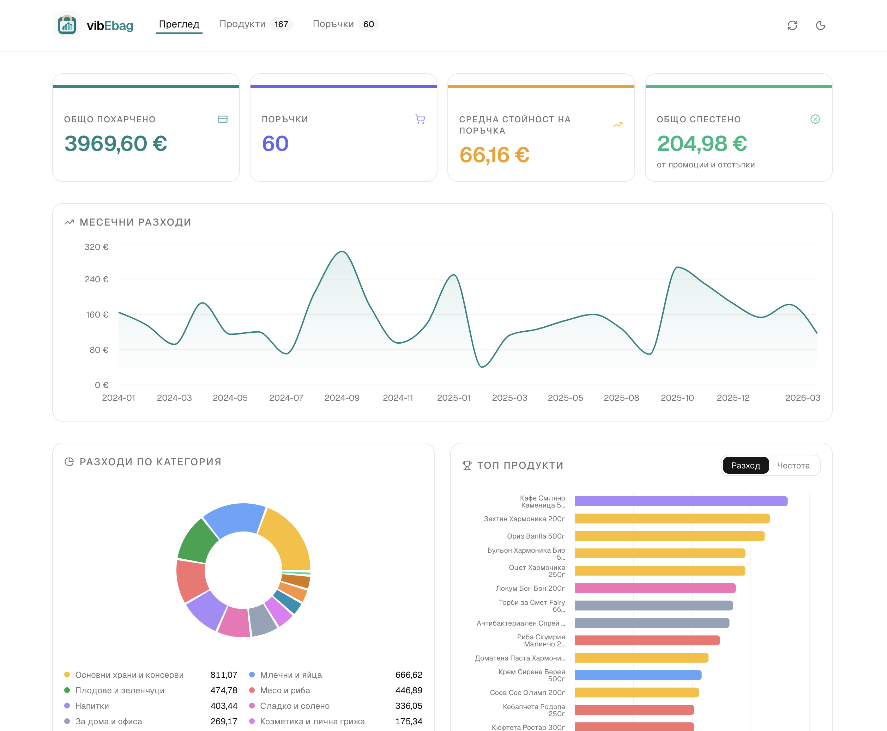
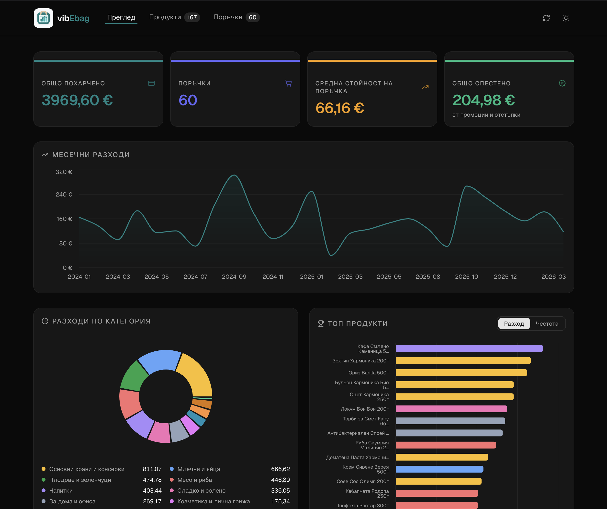

# vibEbag

A personal web dashboard for visualizing grocery spending data from [eBag](https://www.ebag.bg). Fetches your order history via eBag's internal REST API (using session cookies obtained through Playwright) and presents it as an interactive React dashboard — entirely in Bulgarian.

## AI Use Disclaimer
This project is completely vibecoded using mostly Claude Sonnet 4.6 and Opus 4.6.
This section of the README is the only part that has been written by a human. The rest of the code, including this README's content, commit messages, and all comments in the codebase, have been generated by AI.
Some code has been read by humans.

## Screenshots

| Light | Dark |
|---|---|
|  |  |

## Features

- 📊 **Overview dashboard** — KPI tiles, monthly spend area chart, category donut, top products & brands
- 🛍️ **Orders page** — sortable, paginated order list with a detail sheet per order
- 🥦 **Products page** — sortable/filterable product table with price history chart and purchase detail
  - 📈 **Inflation tracker** — for every unique product, see how its unit price has changed across purchases over time
- 🤖 **UI-driven scraping** — login and sync triggered from the browser, with real-time streaming progress
- 🔐 **Headless Playwright login** — automated session management, credentials stored locally
- ⚡ **Incremental fetching** — only new orders are fetched on re-sync
- 🌱 **Synthetic seed data** — faker-generated dev dataset with realistic Bulgarian brands and categories
- 🌙 **Dark mode** — persistent light/dark theme toggle
- 🇧🇬 **Bulgarian UI** — all labels, dates, and formatting in Bulgarian

## Responsible API usage

This tool accesses eBag's internal API using your own session credentials to fetch your own personal data. It is designed to be as light on eBag's infrastructure as possible:

- **Throttled requests** — order detail fetches are limited to 2 concurrent requests with a 500–1000 ms random delay between each one, avoiding any burst load on the API.
- **Incremental fetching** — on every sync, already-fetched orders are skipped entirely. Only new orders since the last run are requested, keeping the total number of API calls to a minimum.
- **Local caching** — all data is stored locally in JSON files and served directly from disk. The API is never contacted just to view the dashboard.

Please use this tool responsibly and only to access your own data.

---

## Project structure

```
vibEbag/
├── scraper/                         # Node.js data-fetching scripts
│   ├── auth.js                      # Playwright login → saves session cookies
│   ├── fetch-orders.js              # Fetches all orders + full line-item details
│   ├── seed.js                      # Generates synthetic dev data
│   └── package.json
├── dashboard/                       # React frontend
│   ├── src/
│   │   ├── App.jsx                  # Root: data loading, routing, login form, sync button
│   │   ├── hooks/
│   │   │   └── useTheme.js          # Dark/light mode toggle, persisted in localStorage
│   │   ├── data/
│   │   │   └── processOrders.js     # Transforms raw JSON into all chart/table data
│   │   ├── pages/
│   │   │   ├── Overview.jsx         # KPI cards, monthly spend, category charts, top products
│   │   │   ├── Products.jsx         # Sortable/filterable product table + price history chart
│   │   │   └── Orders.jsx           # Sortable orders table with sheet detail
│   │   ├── components/ui/           # shadcn components + custom shared components
│   │   └── index.css                # Tailwind v4 entry + shadcn CSS variable theme
│   ├── scraper-plugin.js            # Vite plugin: serves data + exposes scraper API endpoints
│   └── package.json
├── data/                            # Raw fetched data (gitignored)
│   ├── credentials.json             # { email, password } — auto-created on first login
│   ├── cookies.json                 # eBag session cookies
│   ├── order-details.json           # Full per-order details with line items (prod)
│   └── order-details.dev.json       # Synthetic seed data for dev
└── .gitignore
```

---

## Tech stack

| Layer | Choice | Rationale |
|---|---|---|
| Scraper runtime | Node.js (ESM) | Native fetch, no transpilation needed |
| Browser automation | Playwright (Chromium, headless) | Handles cookie consent, login form, session extraction |
| Frontend framework | React 19 + Vite | Fast dev server, minimal config |
| Styling | Tailwind CSS v4 | Utility-first, co-located with markup |
| Component library | shadcn/ui | Unstyled primitives that inherit Tailwind's CSS variable theme; easy to customise |
| Charts | shadcn Charts (Recharts) | Zero-friction integration with shadcn's CSS variable theming |
| Routing | React Router v7 | Three-page app (Overview + Products + Orders) |
| Data storage | Local JSON files | No database; all data is personal and gitignored |

---

## Architectural decisions

### Vite plugin for scraper API
`scraper-plugin.js` exposes API endpoints directly in the Vite dev server via `configureServer`. This avoids running a separate Express server — one `npm run dev` command covers everything. The plugin also serves `order-details.json` from `../data/` so no manual file copying is needed.

### UI-triggered login and scraping
The dashboard shows a login form when no credentials are stored. Login and scraping are triggered from the UI via buttons. Progress is streamed in real time using Server-Sent Events (SSE).

### All data processing in the browser
`src/data/processOrders.js` runs entirely client-side on the raw JSON. No build step is needed when data changes — the Vite plugin serves the latest file automatically.

### Credentials stored in `data/credentials.json`
Credentials are stored as plain JSON alongside other data files rather than in a `.env` file, keeping all sensitive local data in one gitignored directory (`data/`). This is intentional for simplicity — this is a personal local tool, not a deployed service.

### Polite scraping
`fetch-orders.js` uses a concurrency of 2 with 500–1000 ms random delays between requests to avoid hammering eBag's API.

### Incremental fetching
`fetch-orders.js` loads any existing `order-details.json`, builds a Set of known order IDs, and only fetches new orders. Re-running the scrape after new orders are placed is fast.

### `"Променени количества"` group is skipped in aggregations
Items in this group (and `group_name = null` in older orders) are products whose picker-adjusted quantity appears here instead of their real category group. Including them would double-count spend and distort category breakdowns.

### `avgPrice` is average unit price, not average order spend
`item.price` = quantity × unit price (e.g. 2.5 kg × 1.79 лв). Using this directly for average price would produce misleading results for by-weight products. `avgPrice` is computed as the mean of `product_saved.current_price` across all purchases.

---

## Setup & usage

### 1. Install dependencies

```bash
cd scraper && npm install
cd ../dashboard && npm install
```

Playwright's Chromium browser is installed automatically. If needed, run:
```bash
npx playwright install chromium
```

### 2. Start the dashboard

```bash
cd dashboard && npm run dev
```

On first launch, a login form will appear. Enter your eBag email and password — these are saved to `data/credentials.json`. The app then logs in via Playwright (headless) and fetches all your orders automatically.

To re-fetch orders (e.g. after new deliveries), click the sync button (↻) in the header.

### 3. Dev mode with synthetic data

```bash
cd dashboard && npm run dev:seeded
```

Runs the dashboard against `data/order-details.dev.json` — synthetic data generated by `scraper/seed.js`. No real credentials needed.

To regenerate the seed data:
```bash
cd scraper && npm run seed
```

---

## eBag API endpoints

All endpoints require a valid session cookie (obtained via Playwright login). Pass cookies as a `Cookie` header.

### Order list

```
GET https://www.ebag.bg/orders/list/json?page=1&exclude_additional_order=true
```

Response shape:
```json
{
  "count": 132,
  "next": "...?page=2",
  "previous": null,
  "results": [ /* array of order summaries */ ],
  "years_choices": [...],
  "months_choices": [...]
}
```

Each order summary includes: `encrypted_id`, `shipping_date`, `final_amount`, `final_amount_eur`, `order_status`, `last_payment_method`, `products_images_ids`.

Pagination: follow `next` until it is `null`.

### Order details

```
GET https://www.ebag.bg/orders/{encrypted_id}/details/json
```

Response shape:
```json
{
  "order": { /* full order fields */ },
  "grouped_items": [
    {
      "group_name": "Млечни и яйца",
      "group_items": [
        {
          "product_saved": {
            "name_bg": "...",
            "name_en": "...",
            "brand": "...",
            "price": "3.19",
            "price_promo": null,
            "current_price": "3.19",
            "unit_weight": "1.0000",
            "unit_type": 1
          },
          "product": { "id": ..., "url_slug": "...", "main_image_id": ... },
          "quantity": "1.000",
          "price": "3.19",
          "regular_price": "3.19",
          "has_changed_quantity": false
        }
      ]
    }
  ],
  "additional_orders": [ /* same structure, for add-on orders placed after the main order */ ],
  "overall_saved": "3.02",
  "overall_final_amount": "140.22"
}
```

**Important notes for data processing:**
- `grouped_items` on the top-level response covers the main order's line items.
- `additional_orders[].grouped_items` covers add-on orders. Both must be flattened to get all purchased items.
- Items with `group_name = "Променени количества"` are products whose weight was adjusted by the picker. Skip this group when aggregating to avoid double-counting.
- Items with `group_name = null` are changed-quantity items from older orders where the group name wasn't populated. Treat identically to `"Променени количества"`. In the dashboard they are bucketed as `"Друго"`.
- `order_status`: `4` = delivered, `3` = cancelled/other.
- `unit_type`: `1` = sold by weight (kg), `2` = sold by unit.
- `item.price` = quantity × unit price. Use `product_saved.current_price` for the unit price.

### Product images

```
https://www.ebag.bg/media/catalog/product/{main_image_id}.jpg
```

---

## Data model (processOrders.js output)

| Field | Description |
|---|---|
| `totalSpend` | Sum of `order.final_amount` across all orders |
| `totalOrders` | Count of orders |
| `avgBasket` | `totalSpend / totalOrders` |
| `totalSaved` | Sum of `overall_saved` (promo/discount savings) |
| `monthlySpend` | `{ month: "YYYY-MM", spend }[]` sorted chronologically |
| `categorySpend` | `{ category, spend }[]` sorted by spend descending |
| `topProducts` | Top 15 products by total spend |
| `topByFrequency` | Top 15 products by order count |
| `productList` | All unique products with `count`, `totalSpend`, `avgPrice`, `firstPurchase`, `lastPurchase`, `priceHistory[]` |

Each `priceHistory` entry: `{ date, orderId, unitPrice, wasPromo }`.

---

## Data files (gitignored)

All files under `data/` contain personal data. Never commit them.

```
data/credentials.json        — { "email": "...", "password": "..." }
data/cookies.json            — eBag session cookies
data/order-details.json      — full line-item data (prod)
data/order-details.dev.json  — synthetic seed data (dev)
```
