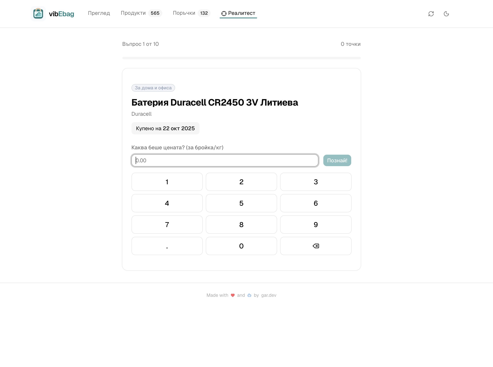
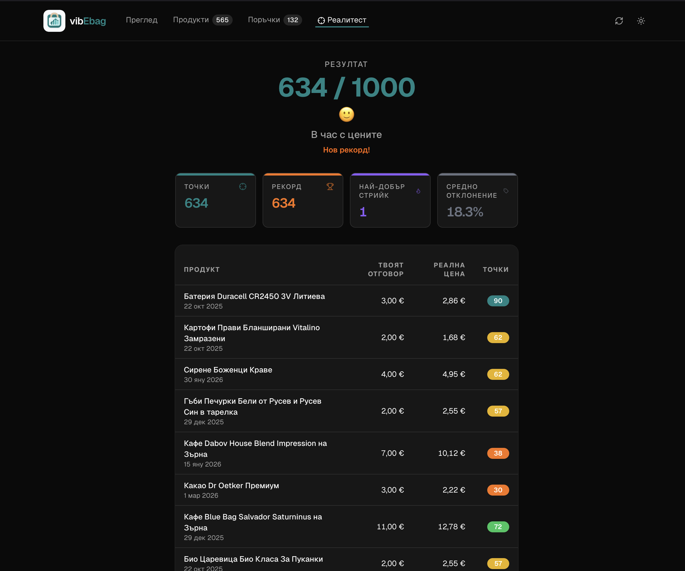

# vibEbag

A personal web dashboard for visualizing grocery spending data from [eBag](https://www.ebag.bg). Fetches your order history via eBag's internal REST API (using session cookies obtained through Playwright) and presents it as an interactive React dashboard — entirely in Bulgarian.

## AI Use Disclaimer
This project is completely vibecoded using mostly Claude Sonnet 4.6 and Opus 4.6.
This section of the README is the only part that has been written by a human. The rest of the code, including this README's content, commit messages, and all comments in the codebase, have been generated by AI.
Some code has been read by humans.

## Screenshots

| Light | Dark |
|---|---|
|  |  |

### Реалитест

| Guessing | Results |
|---|---|
|  |  |

## Features

- 📊 **Overview dashboard** — KPI tiles, monthly spend area chart, category donut, top products & brands
- 🛍️ **Orders page** — sortable, paginated order list with a detail sheet per order
- 🥦 **Products page** — sortable/filterable product table with price history chart and purchase detail
  - 📈 **Inflation tracker** — for every unique product, see how its unit price has changed across purchases over time
- 🎯 **Реалитест** — price guessing game: see a product you bought and try to guess the price, with scoring, streaks, and persistent high scores
- 🤖 **UI-driven scraping** — login and sync triggered from the browser, with real-time streaming progress
- 🔐 **Headless Playwright login** — automated session management, credentials stored locally
- ⚡ **Incremental fetching** — only new orders are fetched on re-sync
- 🌱 **Synthetic seed data** — faker-generated dev dataset with realistic Bulgarian brands and categories
- 🌙 **Dark mode** — persistent light/dark theme toggle
- 🇧🇬 **Bulgarian UI** — all labels, dates, and formatting in Bulgarian

## Responsible API usage

This tool accesses eBag's internal API using your own session credentials to fetch your own personal data. It is designed to be as light on eBag's infrastructure as possible:

- **Throttled requests** — order detail fetches are limited to 2 concurrent requests with a 500–1000 ms random delay between each one, avoiding any burst load on the API.
- **Incremental fetching** — on every sync, already-fetched orders are skipped entirely. Only new orders since the last run are requested, keeping the total number of API calls to a minimum.
- **Local caching** — all data is stored locally in JSON files and served directly from disk. The API is never contacted just to view the dashboard.

Please use this tool responsibly and only to access your own data.

---

## Project structure

```
vibEbag/
├── scraper/                         # Node.js data-fetching scripts
│   ├── auth.js                      # Playwright login → saves session cookies
│   ├── fetch-orders.js              # Fetches all orders + full line-item details
│   ├── seed.js                      # Generates synthetic dev data
│   └── package.json
├── dashboard/                       # React frontend
│   ├── src/
│   │   ├── App.jsx                  # Root: data loading, routing, login form, sync button
│   │   ├── hooks/
│   │   │   └── useTheme.js          # Dark/light mode toggle, persisted in localStorage
│   │   ├── data/
│   │   │   └── processOrders.js     # Transforms raw JSON into all chart/table data
│   │   ├── pages/
│   │   │   ├── Overview.jsx         # KPI cards, monthly spend, category charts, top products
│   │   │   ├── Products.jsx         # Sortable/filterable product table + price history chart
│   │   │   └── Orders.jsx           # Sortable orders table with sheet detail
│   │   ├── components/ui/           # shadcn components + custom shared components
│   │   └── index.css                # Tailwind v4 entry + shadcn CSS variable theme
│   ├── scraper-plugin.js            # Vite plugin: serves data + exposes scraper API endpoints
│   └── package.json
├── data/                            # Raw fetched data (gitignored)
│   ├── credentials.json             # { email, password } — auto-created on first login
│   ├── cookies.json                 # eBag session cookies
│   ├── order-details.json           # Full per-order details with line items (prod)
│   └── order-details.dev.json       # Synthetic seed data for dev
└── .gitignore
```

---

## Tech stack

| Layer | Choice | Rationale |
|---|---|---|
| Scraper runtime | Node.js (ESM) | Native fetch, no transpilation needed |
| Browser automation | Playwright (Chromium, headless) | Handles cookie consent, login form, session extraction |
| Frontend framework | React 19 + Vite | Fast dev server, minimal config |
| Styling | Tailwind CSS v4 | Utility-first, co-located with markup |
| Component library | shadcn/ui | Unstyled primitives that inherit Tailwind's CSS variable theme; easy to customise |
| Charts | shadcn Charts (Recharts) | Zero-friction integration with shadcn's CSS variable theming |
| Routing | React Router v7 | Three-page app (Overview + Products + Orders) |
| Data storage | Local JSON files | No database; all data is personal and gitignored |

---

## Setup & usage

### Prerequisites

This project uses [mise](https://mise.jdx.dev/) to manage the Node.js version. Install mise, then run:

```bash
mise install
```

### 1. Install dependencies

```bash
cd scraper && npm install
cd ../dashboard && npm install
```

Playwright's Chromium browser is installed automatically. If needed, run:
```bash
npx playwright install chromium
```

### 2. Start the dashboard

```bash
cd dashboard && npm run dev
```

On first launch, a login form will appear. Enter your eBag email and password — these are saved to `data/credentials.json`. The app then logs in via Playwright (headless) and fetches all your orders automatically.

To re-fetch orders (e.g. after new deliveries), click the sync button (↻) in the header.

### 3. Dev mode with synthetic data

```bash
cd dashboard && npm run dev:seeded
```

Runs the dashboard against `data/order-details.dev.json` — synthetic data generated by `scraper/seed.js`. No real credentials needed.

To regenerate the seed data:
```bash
cd scraper && npm run seed
```

